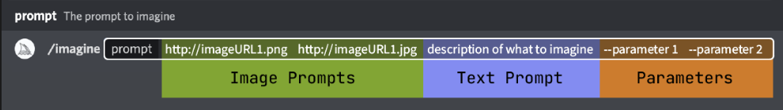

## 一、Prompts

prompts（提示）是 Midjourney Bot 解释以生成图像的短文本短语。Midjourney Bot 将提示中的单词和短语分解为更小的部分，称为标记，可以将其与其训练数据进行比较，然后用于生成图像。精心制作的提示可以帮助制作独特而令人兴奋的图像。

### 1. 结构

提示可以像一个单词、短语、emoji一样简单，也可以使用更高级的提示。

更高级的提示可以包括一个或多个[图像 URL](https://docs.midjourney.com/image-prompts)、[多个文本短语](https://docs.midjourney.com/multi-prompts)以及一个或多个[参数](https://docs.midjourney.com/parameter-list)

image Prompts

可以将图像 URL 添加到提示中以影响最终结果的样式和内容。

**图片 URL 始终位于提示的前面。**

Text Prompt

要生成的图像的文本描述。

Parameters

Parameters位于提示的末尾，它可以改变图像的生成方式。

用--表示。

可以更改宽高比、模型、放大器等等。

### 2. 需要注意的提示点

#### 长度

非常短的提示将在很大程度上依赖于 Midjourney 的默认样式。

更具描述性的提示更适合独特的外观。

#### 语法

不是越长越好，要提取重点词，专注于要创建的主要概念。因为midjourney不是像人类那样理解语法。

要用更精准的词汇，比如：大，是怎么样的大？

big, try gigantic, enormous, immense

#### 去掉不需要的内容

[`--no`](https://docs.midjourney.com/multi-prompts)参数加上的东西可以告诉midjourney，你不想在图像上出现什么

比如不想要蛋糕，可以加上`--no cake`

（唔、挺惊悚的）

#### 考虑哪些细节很重要

**尽量把很重要的任何背景或细节搞清楚：**

- **主题：**人、动物、人物、地点、物体等。
- **媒介：**照片、绘画、插图、雕塑、涂鸦、挂毯等。
- **环境：**室内、室外、月球上、纳尼亚、水下、翡翠城等。
- **照明：**柔和、环境、阴天、霓虹灯、工作室灯等
- **颜色：**充满活力、柔和、明亮、单色、彩色、黑白、柔和等。
- **情绪：**稳重、平静、喧闹、精力充沛等。
- **构图：**肖像、头像、特写、鸟瞰图等。

**把官网的英文摘下来作参考：**

- **Subject:** person, animal, character, location, object, etc.
- **Medium:** photo, painting, illustration, sculpture, doodle, tapestry, etc.
- **Environment:** indoors, outdoors, on the moon, in Narnia, underwater, the Emerald City, etc.
- **Lighting:** soft, ambient, overcast, neon, studio lights, etc
- **Color:** vibrant, muted, bright, monochromatic, colorful, black and white, pastel, etc.
- **Mood:** Sedate, calm, raucous, energetic, etc.
- **Composition:** Portrait, headshot, closeup, birds-eye view, etc.

### 使用具体数字

比如"three birds"就比"birds"更加精确

### 3. Exprore Prompting（探索提示）

#### 选择媒介

常用的媒介类型：

 

<strong data-tomark-pass="">版画</strong>

    <strong data-tomark-pass="">民间艺术</strong>

<strong data-tomark-pass="">蓝版</strong>

 

<strong data-tomark-pass="">涂鸦</strong>

<strong data-tomark-pass="">按数字绘画</strong>

<strong data-tomark-pass="">曲线图</strong>

<strong data-tomark-pass="">浮世绘</strong>

<strong data-tomark-pass="">铅笔素描</strong>

<strong data-tomark-pass="">水彩</strong>

<strong data-tomark-pass="">像素艺术</strong>

<strong data-tomark-pass="">黑光绘画</strong>

<strong data-tomark-pass="">十字绣</strong>

    

